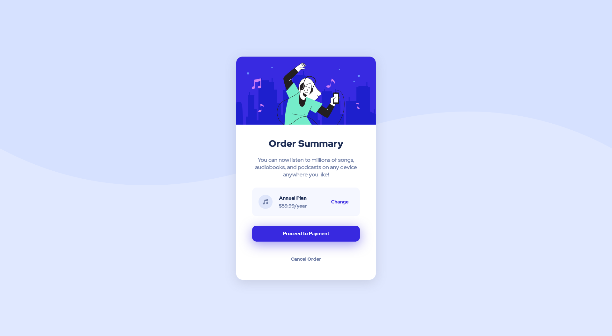

# Frontend Mentor - Order summary card solution

This is a solution to the [Order summary card challenge on Frontend Mentor](https://www.frontendmentor.io/challenges/order-summary-component-QlPmajDUj). Frontend Mentor challenges help you improve your coding skills by building realistic projects. 

## Table of contents

- [Overview](#overview)
  - [The challenge](#the-challenge)
  - [Screenshot](#screenshot)
  - [Links](#links)
- [My process](#my-process)
  - [Built with](#built-with)
  - [What I learned](#what-i-learned)
- [Author](#author)

## Overview

### The challenge

Users should be able to:

- See hover states for interactive elements

### Screenshot

### Links

- Live Site URL: [https://polthm.github.io/order-summary-component/](https://polthm.github.io/order-summary-component/)

## My process

### Built with

HTML and SCSS

### What I learned

To have fun

## Author

- Website - [https://pol-thomas.com/](https://pol-thomas.com/)
- Frontend Mentor - [@PolThm](https://www.frontendmentor.io/profile/PolThm)